# UniPlat (University Platform) API
This API was made for the final project. The project is about a social media platform for universities.

In this platform, students and teachers can register for the application with our academic emails, and they can share posts, create activities (events) and join 
them. All users can open clubs and follow these pages. In order to avoid confusion in the application, only teachers are authorized to open a university page.

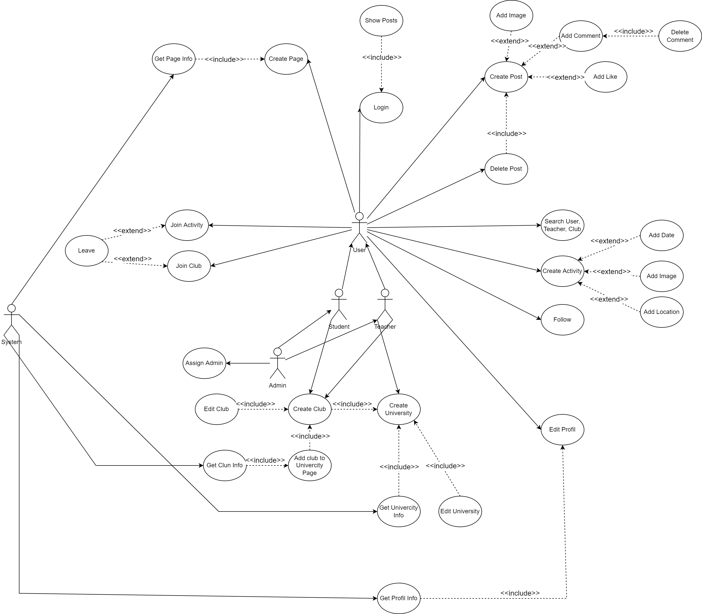

You can get information about the project from the links below.

[Frontend](https://github.com/FurkanGundogan/uniplat-frontend)

[Demo Video](https://www.youtube.com/watch?v=sGqz75Ve1kQ)

# Overview
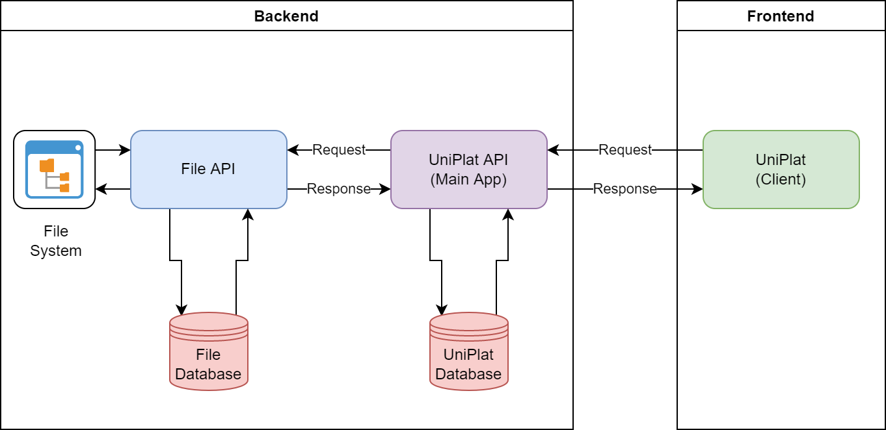

The client makes a request to the UniPlat API from the UniPlat interface and the transactions are executed with the UniPlat database.If it wants to perform a 
file-related operation, uniplat api requests the file api, where the file is renamed (uuid is assigned) and the file is saved to the system. The id and type of 
the file are saved in the database.

## Flyway
Flyway is used for database migrations. All sql files are in resources/db/migration/postgresql path.

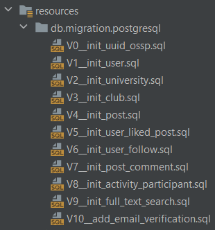

All migrations are run after the application runs, and they are not run again. If there is a change in a migration, flyway gives an error message. It provides 
this with checksum control.

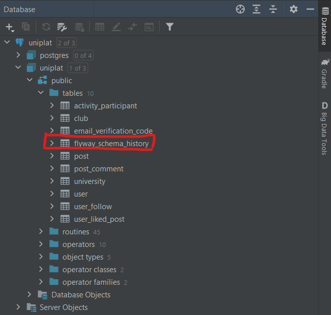

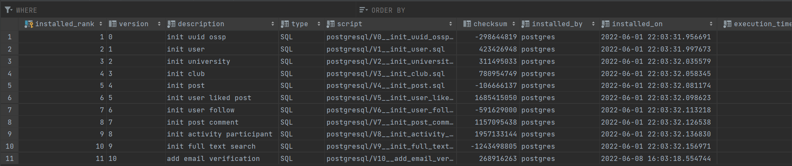

## Email Verification
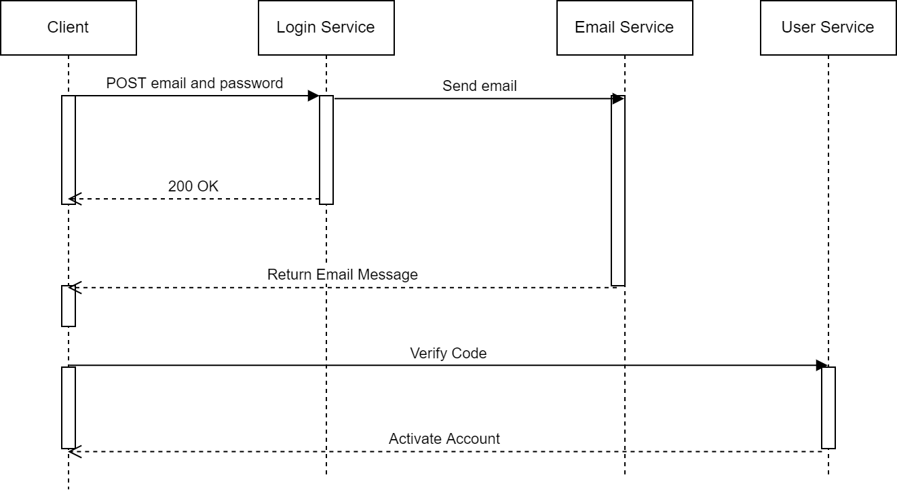

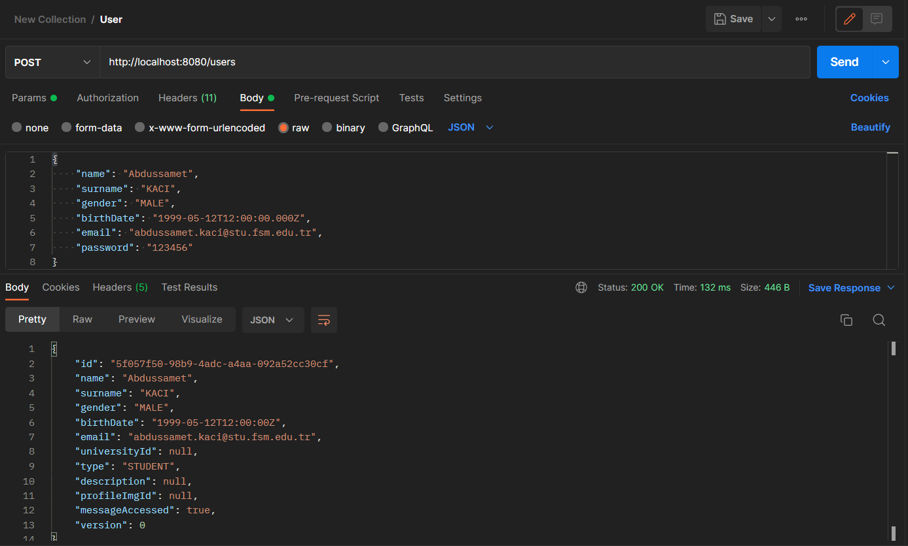

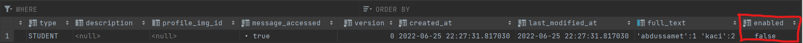

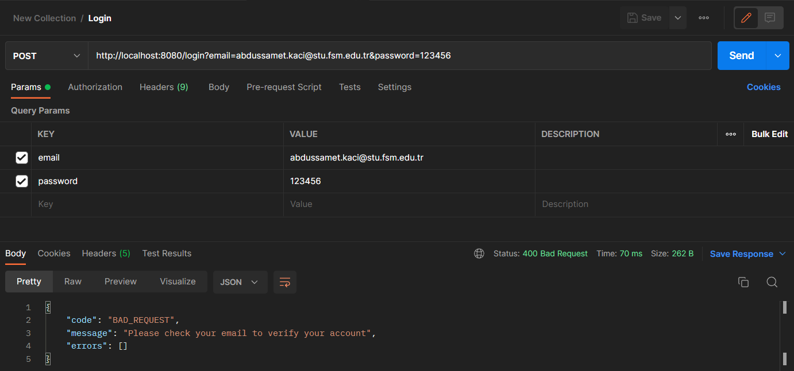

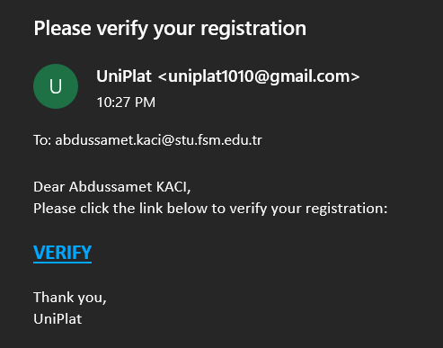

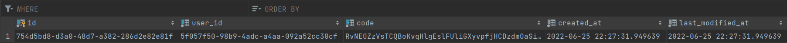

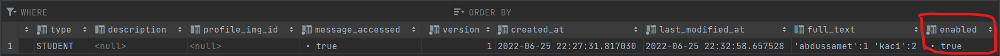

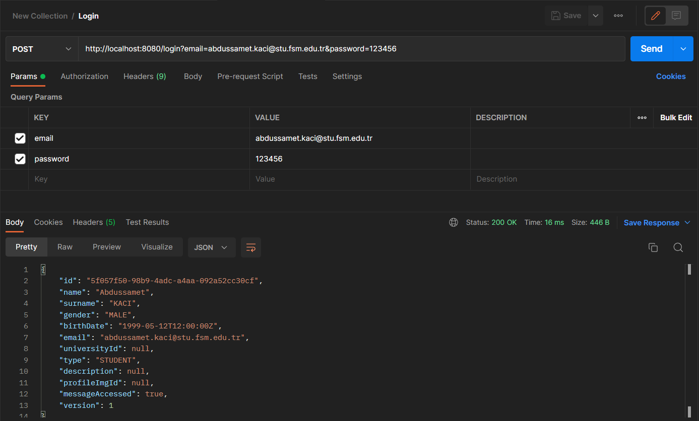

## Database
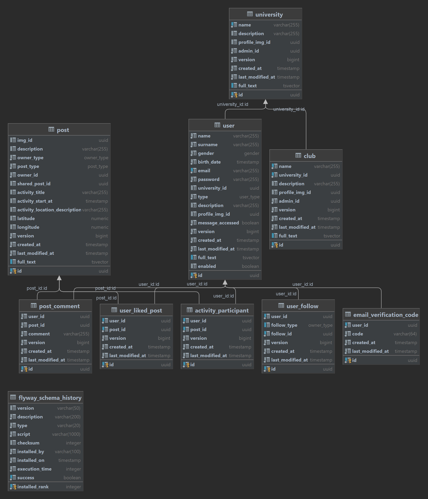

## Full-Text Search
The texts in all entered records are stored in a column called full_text, in which indexes the words are in the text.

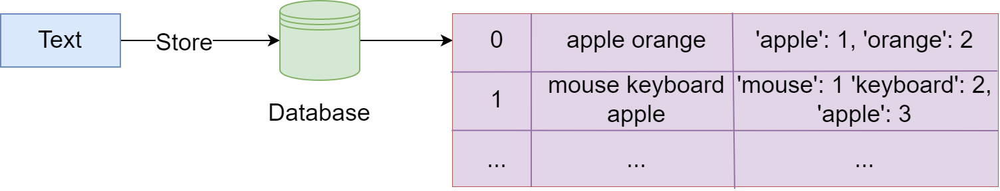

Tables with full text search applied:
1) user -> name, surname, description
2) university -> name, description
3) club -> name, description
4) activity -> description, activity_title, activity_location_description

With this method, our search speed increases, but there is a loss of performance in writing operations in the database.
It is the search service that performs this action.

## Conclusion
I tried to give you information about the project. I also gave information about some important parts of the project. You can watch the video to see the project.